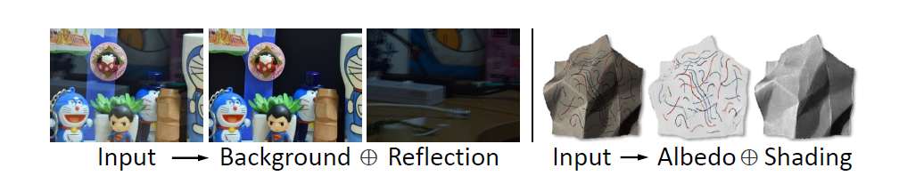
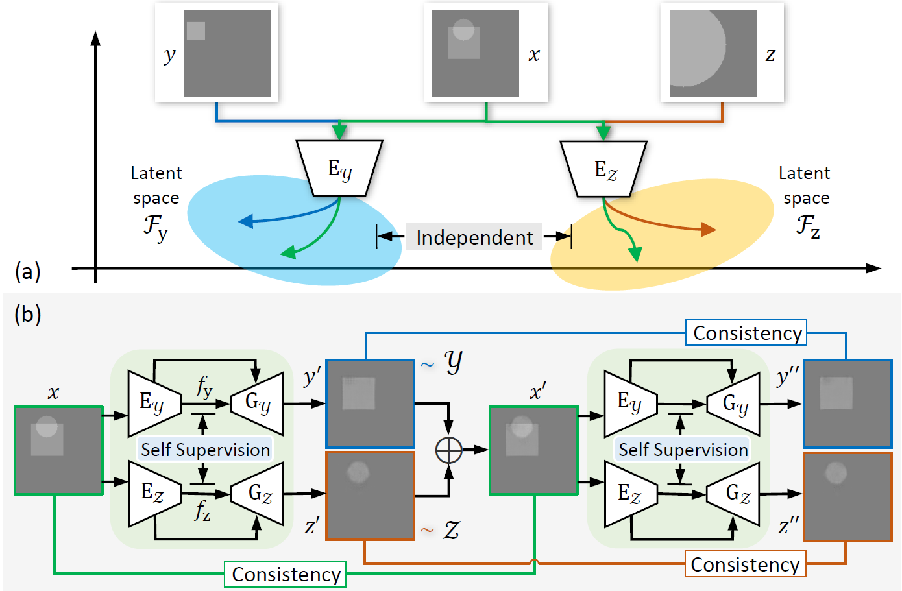

# Separate In Latent Space: Unsupervised Single Image Layer Separation

  

**Picture:** *Examples of single image layer separation: reflection separation and intrinsic image decomposition.*

  
  

**Picture:** *(a) Illustrations of the shared information consistency and layer independence assumptions. (b) The overall framework of our unsupervised SILS method.*

This repository contains the official PyTorch implementation of the following paper:

> **Separate In Latent Space: Unsupervised Single Image Layer Separation** 
>  Yunfei Liu, Feng Lu 
> https://arxiv.org/abs/1906.00734
>
> **Abstract:**  Many real world vision tasks, such as reflection removal from a transparent surface and intrinsic image decomposition, can be modeled as single image layer separation. However, this problem is highly ill-posed, requiring accurately aligned and hard to collect triplet data to train the CNN models. To address this problem, this paper proposes an unsupervised method that requires no ground truth data triplet in training. At the core of the method are two assumptions about data distributions in the latent spaces of different layers, based on which a novel unsupervised layer separation pipeline can be derived. Then the method can be constructed based on the GANs framework with self-supervision and cycle consistency constraints, etc. Experimental results demonstrate its successfulness in outperforming existing unsupervised methods in both synthetic and real world tasks. The method also shows its ability to solve a more challenging multi-layer separation task. 

## Resources

Material related to our paper is available via the following links:

- Paper: https://arxiv.org/abs/1906.00734
- Project: Coming soon!
- Code: https://github.com/DreamtaleCore/SILS

## System requirements

* Only Linux is tested, Windows is under test.
* 64-bit Python 3.6 installation. 
* PyTorch 1.2.0 or newer with GPU support.
* One or more high-end NVIDIA GPUs with at least 8GB of DRAM.
* NVIDIA driver 391.35 or newer, CUDA toolkit 9.0 or newer, cuDNN 7.3.1 or newer.

## Playing with pre-trained networks and training

Coming soon!